# データベース設計（概要）

Cloudflare D1（SQLite互換）を想定。物理的なカラム型・インデックス・マイグレーションの詳細は詳細設計またはPrisma導入時に確定する。本書はテーブル構成と関連の概要を示す。

## ER図

> 図のソースは [`01_データベース.01.mmd`](./01_データベース.01.mmd)（mermaid）。編集後の再生成コマンドは `docs/diagrams.md` を参照。

## テーブル一覧

| テーブル | 役割 |
| --- | --- |
| `families` | 家族グループ |
| `users` | 登録ユーザー（Googleアカウント連携） |
| `unregistered_members` | 非登録メンバー（名前のみ、担当者専用） |
| `categories` | カテゴリの固定マスタ（6種類） |
| `todos` | ToDo本体 |
| `todo_assignees` | ToDoと担当者（ユーザー or 非登録メンバー）の中間テーブル |
| `comments` | ToDoへのコメント |
| `notification_settings` | 通知種別ごとのON/OFF・リマインド時間 |
| `push_subscriptions` | Web Push（VAPID）の購読情報 |

## 各テーブルの概要

### families
| カラム | 説明 |
| --- | --- |
| id | 主キー |
| name | グループ名 |
| invite_code | 招待コード（招待リンクにも使用）。半角英数字8桁（大文字） |
| invite_code_expires_at | 招待コードの有効期限。発行日時の7日後 |
| created_by_user_id | 作成者（グループ削除権限の判定に使用） |
| created_at | 作成日時 |

### users
| カラム | 説明 |
| --- | --- |
| id | 主キー |
| google_sub | GoogleアカウントのID（OAuthのsub） |
| email | Googleアカウントのメールアドレス |
| display_name | アプリ内表示名（Googleの氏名とは別に設定可能） |
| default_due_time | 時刻を指定していない期限を何時として扱うか（時刻のみ。既定 `20:00`）。期限接近・期限超過の通知の判定に使う |
| family_id | 所属する家族グループ（nullable。未所属の間はNULL） |
| created_at | 作成日時 |

### unregistered_members
| カラム | 説明 |
| --- | --- |
| id | 主キー |
| family_id | 所属する家族グループ |
| name | 名前（`family_id`内で一意） |
| created_at | 作成日時 |

### categories
| カラム | 説明 |
| --- | --- |
| id | 主キー |
| name | カテゴリ名（学校・仕事・習い事・家事・買い物・その他の固定6件をseedで投入） |

### todos
| カラム | 説明 |
| --- | --- |
| id | 主キー |
| family_id | 所属する家族グループ |
| title | タイトル（必須） |
| memo | 詳細メモ（任意） |
| due_at | 期限（日付のみ、または日付＋時刻。nullable） |
| due_has_time | `due_at`に時刻を含むかどうか |
| priority | 優先度（`high`/`medium`/`low`） |
| category_id | カテゴリ |
| status | 完了状態（`incomplete`/`completed`） |
| recurrence_type | 繰り返し種別（`none`/`daily`/`weekly`/`monthly`） |
| recurrence_config | 繰り返しの詳細（毎週の曜日、毎月の日付など。JSON） |
| created_by_user_id | 作成者 |
| completed_by_user_id | 完了者（nullable。未完了時はNULL） |
| completed_at | 完了日時（nullable） |
| created_at / updated_at | 作成・更新日時 |

### todo_assignees
| カラム | 説明 |
| --- | --- |
| id | 主キー |
| todo_id | 対象ToDo |
| user_id | 担当者が登録ユーザーの場合のID（`unregistered_member_id`と排他。両方NULLは不可） |
| unregistered_member_id | 担当者が非登録メンバーの場合のID（`user_id`と排他） |
| is_follower | 非登録メンバーの担当に付随する「フォロー役」の登録ユーザーかどうか |

- 制約: 非登録メンバーを担当者に含める場合、同一ToDoの担当者に `is_follower = true` の登録ユーザーが最低1件必要（アプリ側で保証する）。
- 制約: 同一グループ内で非登録メンバー名は一意（`unregistered_members`側の制約）。

### comments
| カラム | 説明 |
| --- | --- |
| id | 主キー |
| todo_id | 対象ToDo |
| user_id | 投稿者 |
| body | 本文 |
| created_at / updated_at | 投稿・更新日時 |

- グループの全メンバーが任意のコメントを編集・削除できる（投稿者限定ではない）。既読管理は行わない。

### notification_settings
| カラム | 説明 |
| --- | --- |
| id | 主キー |
| user_id | 対象ユーザー |
| notification_type | 通知種別（`todo_added`/`assignee_set`/`due_soon`/`overdue`） |
| enabled | ON/OFF |
| remind_before_value | `due_soon`（期限接近）のみ使用。何時間/日前か |
| remind_before_unit | `remind_before_value`の単位（`hours`/`days`） |

- ユーザーごとに4種類×1行、初回ログイン時にデフォルト値（すべてON、期限接近は1日前など）でseedする想定。

### push_subscriptions
| カラム | 説明 |
| --- | --- |
| id | 主キー |
| user_id | 対象ユーザー |
| endpoint / p256dh / auth | Web Push（VAPID）の購読情報一式 |
| created_at | 登録日時 |

- 1ユーザーが複数デバイス/ブラウザを持つ可能性があるため1対多。
