# 画面遷移図



> 図のソースは [`画面遷移図.01.mmd`](./画面遷移図.01.mmd)（mermaid）。編集後は次で再生成する（プロジェクトのルートフォルダで実行。要 Docker Desktop 起動）:
>
> ```powershell
> docker run --rm -v ${PWD}:/data minlag/mermaid-cli:11.12.0 -i docs/specs/02_basic-design/画面遷移図.01.mmd -o docs/specs/02_basic-design/画面遷移図.01.svg
> ```

## 画面一覧

要件定義書「13. 画面一覧」に対応する8画面。詳細は [`family-todo/README.md`](family-todo/README.md) から各画面の設計書へ。

| 画面 | 役割 |
| --- | --- |
| ログイン画面 | Googleログイン。所属グループの有無で遷移先を振り分ける |
| 家族グループ作成・参加画面 | グループ未所属のユーザーが作成 or 招待リンク/コードで参加する |
| ToDo一覧画面 | 未完了/完了タブ、カテゴリ表示。ログイン後のホーム |
| ToDo追加・編集画面 | ToDoの新規作成・既存編集を1画面で兼用 |
| ToDo詳細画面 | ToDo詳細表示＋コメント |
| 家族グループ設定画面 | メンバー一覧、非登録メンバー管理、招待リンク発行、グループ削除 |
| 個人設定画面 | 表示名、通知種別ごとのON/OFF、リマインド時間 |
| iOSインストール案内 | iOS Safariかつ未インストール時にバナー/モーダルで表示 |

## 遷移の要点

- ログイン直後、所属グループが無ければ「家族グループ作成・参加画面」へ強制的に遷移する（ToDo一覧はグループ所属が前提のため）。
- 「家族グループ設定画面」でグループを削除した場合、または自分がグループを退出した場合は「家族グループ作成・参加画面」に戻る（グループ無しの状態になるため）。
- iOSインストール案内は、iOS Safariかつホーム画面未インストールの場合に、遷移先の画面（「家族グループ作成・参加画面」「ToDo一覧画面」のいずれか）にオーバーレイ表示する。未所属の初回ログインでも、所属グループありでも同じ条件で表示し、閉じる（後で）と表示元の画面にそのまま留まる（画面上部の常設バナー。タップすると追加手順のモーダルが開く。閉じると7日間表示しない。詳細は [`family-todo/24_iOSインストール案内.md`](family-todo/24_iOSインストール案内.md)）。
